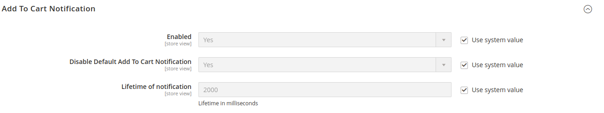

# Magento 2 Add To Cart Notification

Show a pretty notification after add to cart.

## Installation

```bash
composer require mooore/magento2-module-add-to-cart-notification
bin/magento setup:upgrade
```

## Configuration

Go to `System -> Configuration -> Sales -> Checkout -> Add To Cart Notification` to configure the module.


